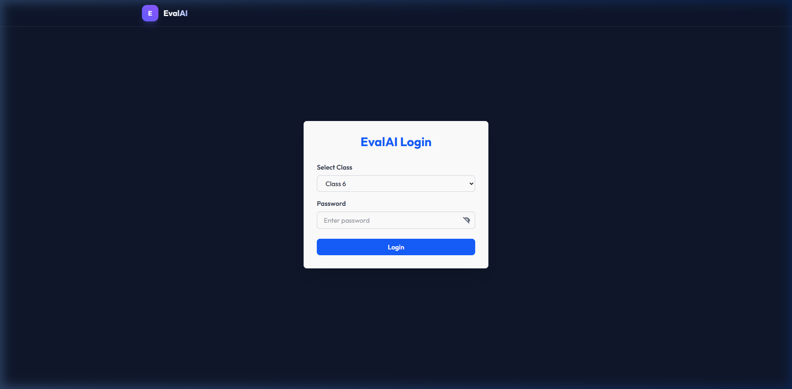
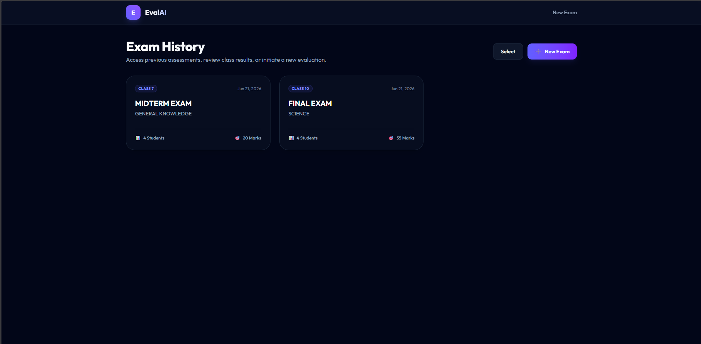
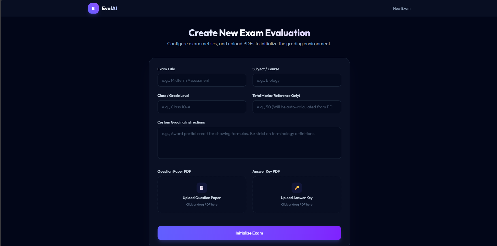
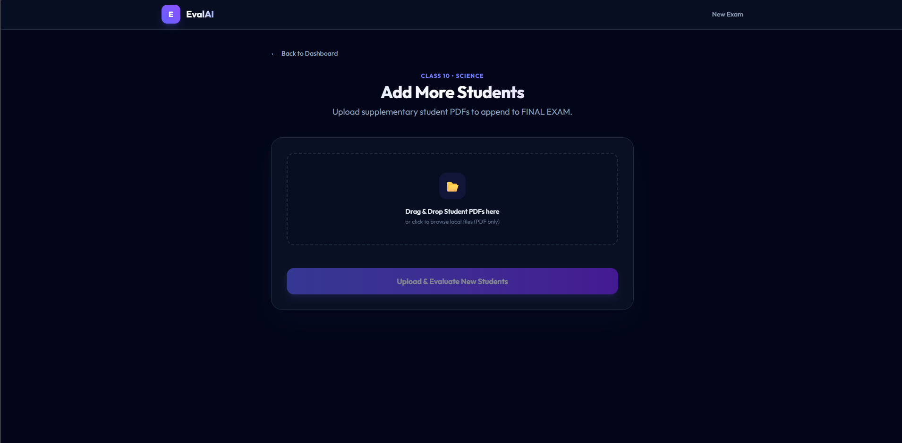
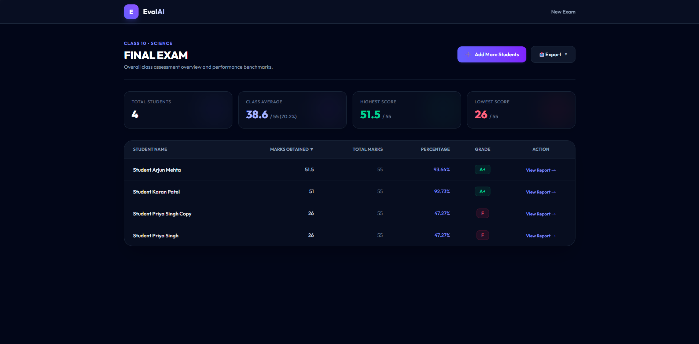
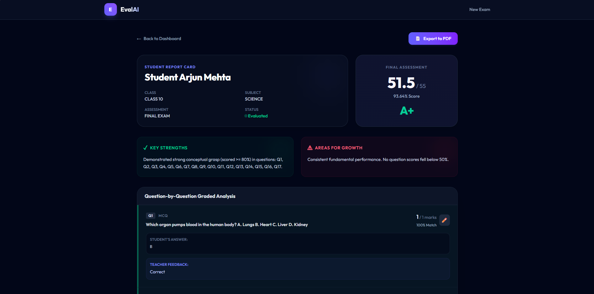
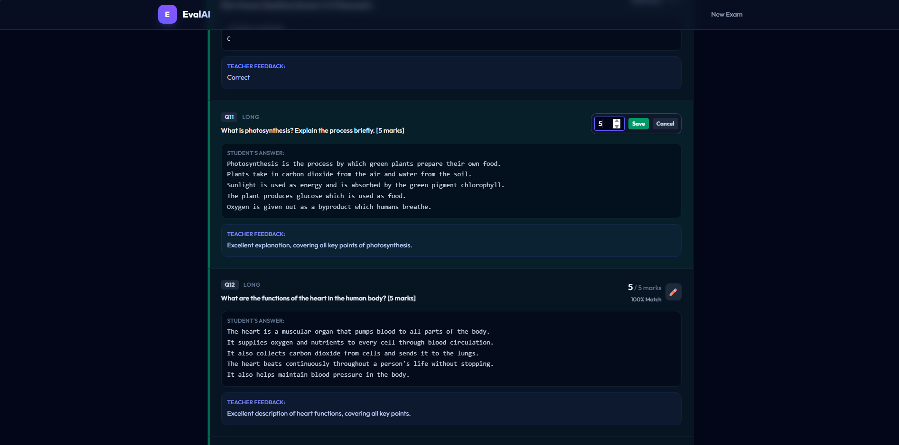
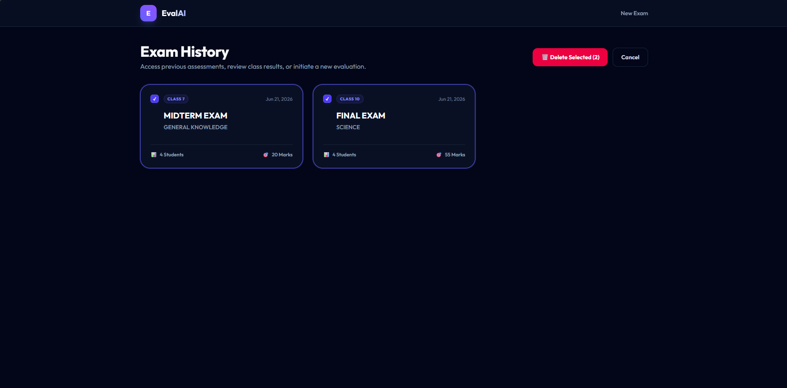

# EvalAI — AI-Powered Exam Evaluation Platform

> Built for school teachers. Powered by Groq LLM. Designed to save hours of manual grading.

EvalAI is an intelligent answer sheet evaluation platform that automatically grades typed student PDF answer sheets against a question paper and reference answer key. It understands meaning — not just keywords — so students get fair, consistent marks even when their wording differs from the model answer.

---

## What It Does

Traditional exam grading is slow, inconsistent, and exhausting. EvalAI changes that.

Upload a question paper, an answer key, and a batch of student answer sheets. EvalAI reads every answer, evaluates it against the key using AI, awards marks — including partial marks for theory — and generates a full class dashboard with individual student breakdowns, all in minutes.

- **MCQ questions** are graded by exact answer matching — fast and deterministic
- **Theory questions** are evaluated semantically — the AI understands what the student meant, not just what they wrote
- **Partial marks** are awarded based on completeness and conceptual accuracy
- **Consistent standards** are maintained across every student in the batch
- **JWT Authentication** keeps each class's data secure and separate

---

## Key Features

- **Bulk PDF Upload** — Upload 100+ student answer sheets at once, each as a separate PDF
- **AI Semantic Evaluation** — Theory answers graded by concept, not keyword matching
- **Mixed Question Support** — Single exam can contain MCQs, short answers, and long answers
- **Class Dashboard** — Sortable results table with scores, percentages, and grades at a glance
- **Individual Student Reports** — Question-by-question breakdown with feedback for each student
- **Manual Mark Override** — Teachers can adjust any AI-awarded mark with a single click
- **Exam History** — All past exams saved and accessible anytime with multi-select delete
- **Add Students Anytime** — Upload more student sheets to an existing exam after evaluation
- **Authenticated Export** — Download class results as Excel or PDF via secure authenticated blob download
- **Password Visibility Toggle** — Eye icon to show/hide password on the login screen
- **JWT Authentication** — Class-based login with secure token-based sessions
- **Mock Evaluator Fallback** — Works without an API key using keyword-based matching

## Screenshots

### Login Page


---

### Exam History


---

### New Exam Setup


---

### Student Upload


---

### Class Dashboard


---

### Student Report


---

### Manual Mark Override


---

### Delete Exam Feature


## How It Works

<table>
<tr>

<td align="center">
<b>Teacher Uploads</b><br><br>
<code>Question Paper  </code><br>
<code>Answer Key      </code><br>
<code>Student Sheets  </code><br>
<code>PDF per student </code>
</td>

<td align="center"><b>&nbsp;&nbsp;──▶&nbsp;&nbsp;</b></td>

<td align="center">
<b>EvalAI Processes</b><br><br>
<code>Parse questions </code><br>
<code>Extract marks   </code><br>
<code>Map answers     </code><br>
<code>AI evaluation   </code>
</td>

<td align="center"><b>&nbsp;&nbsp;──▶&nbsp;&nbsp;</b></td>

<td align="center">
<b>Teacher Receives</b><br><br>
<code>Class Dashboard </code><br>
<code>Student Reports </code><br>
<code>Excel Export    </code><br>
<code>PDF Reports     </code>
</td>

</tr>
</table>

**Phase 1 — Understanding the Exam**
The system parses the question paper to extract every question, its marks, and its type. The answer key is mapped question by question. The AI now understands the full exam structure before touching a single student sheet.

**Phase 2 — Evaluating Student Answers**
Student sheets are parsed and each answer is mapped to its question. For MCQs, answers are compared directly. For theory, all students' answers for the same question are sent to Groq in batches — ensuring consistent marking standards across the entire class.

**Phase 3 — Results & Reporting**
Scores are compiled per student, percentages and grades are calculated, and a full interactive dashboard is generated. Teachers can review, override, and export results.

---

## Deployment & Live Architecture

EvalAI is structured for production cloud hosting:

| Component | Platform | Configuration |
|---|---|---|
| **Frontend** | Vercel | Framework preset: Vite; output dir: `dist`; env: `VITE_API_BASE` |
| **Backend** | Render (Node.js) | Runtime: Node >=18; start command: `node index.js`; env: `DATABASE_URL`, `GROQ_API_KEY`, `JWT_SECRET`, `CLASS_*` |
| **Database** | Supabase PostgreSQL | Connection via IPv4 Transaction Pooler; SSL required (`rejectUnauthorized: false`); schema auto-initialized on server start |

### Architecture Flow

```
Browser ──▶ Vercel (Vite-built SPA)
                │
                │  api.get('/api/...') with Authorization: Bearer <JWT>
                ▼
        Render (Express 5 Server)
                │
                │  pg Pool query
                ▼
        Supabase PostgreSQL (SSL Pooler)
```

- **Database initialization** runs automatically on backend startup via `backend/database/db.js:initializeDatabase()` — executes `schema.sql` then applies `ALTER TABLE ... ADD COLUMN IF NOT EXISTS` migrations.
- **No manual schema migration steps** are needed after the initial deploy.

---

## Tech Stack

| Layer | Technology |
|---|---|
| Frontend | React 19, Tailwind CSS 4, React Router 7, Vite 8 (with `@tailwindcss/vite` plugin) |
| Backend | Node.js, Express 5 (pg Pool with SSL, auto-migrations) |
| Database | PostgreSQL (Supabase via cloud connection pooler) |
| AI Evaluation | Groq API (llama-3.3-70b-versatile, batch size 25, retry on 429) |
| PDF Parsing | pdf-parse (Uint8Array → PDFParse) |
| File Uploads | Multer 2 (disk storage, 10MB limit) |
| Excel Export | SheetJS (xlsx) via reportGenerator.js |
| PDF Export | jsPDF (server-side) via reportGenerator.js |
| Auto-Migrations | `initializeDatabase()` — `ALTER TABLE ... ADD COLUMN IF NOT EXISTS` on startup |

---

## Getting Started

### Prerequisites
- Node.js v18 or higher
- PostgreSQL database
- A free [Groq API Key](https://console.groq.com) (optional — falls back to mock evaluator)

---

### Step 1 — Database Setup

Create a PostgreSQL database and run the schema:

```bash
createdb evalai
psql -d evalai -f backend/database/schema.sql
```

---

### Step 2 — Backend Setup

```bash
cd backend
npm install
```

Create a `.env` file in the backend folder:

```env
PORT=5000
GROQ_API_KEY=your_groq_api_key_here
JWT_SECRET=your_secret_key_here
CLASS_1_NAME=Class 10
CLASS_1_PASSWORD=class10pass
```

Start the backend server:

```bash
node index.js
```

Backend runs at `http://localhost:5000`

---

### Step 3 — Frontend Setup

```bash
cd frontend
npm install
npm run dev
```

Frontend runs at `http://localhost:5173` — open this in your browser.

### Frontend Environment Configuration

The file `frontend/src/config.js` controls API routing:

```js
export const API_BASE = import.meta.env.VITE_API_BASE || `http://${window.location.hostname}:5000`;
```

- **Production (Vercel):** Set `VITE_API_BASE` to your Render backend URL in the Vercel project dashboard → Environment Variables. Vite bakes this value at build time.
- **Local development:** No config needed — it auto-resolves to `http://localhost:5000` using `window.location.hostname`.

---

## Grading System

**MCQ Rules**
- Correct answer → Full marks
- Incorrect answer → Zero marks
- No partial marking for MCQs

**Theory Rules**
- AI evaluates based on conceptual understanding
- Partial marks awarded in increments of 0.5
- One-line feedback provided per question
- Consistent standards maintained across all students
- Falls back to keyword matching if no API key is configured

**Grade Scale**

| Percentage | Grade |
|---|---|
| 90 – 100% | A+ |
| 80 – 89% | A |
| 70 – 79% | B |
| 60 – 69% | C |
| 50 – 59% | D |
| Below 50% | F |

---

## Security Architecture

### Class-Based JWT Authentication

Each class has its own login credentials configured in the `.env` file (`CLASS_1_NAME`, `CLASS_1_PASSWORD`, etc.). Credentials are never stored in the database — they exist only as environment variables.

**Token Lifecycle:**
- On successful login, `jwt.sign({ classId, className }, JWT_SECRET, { expiresIn: '24h' })` issues a JWT
- Token payload includes `classId` and `className`; no password is embedded
- The `middleware/auth.js` `authenticateToken` function extracts the `Bearer` token from the `Authorization` header, verifies it with `jwt.verify()`, and attaches `req.classId` / `req.className` to downstream handlers

**Route Protection Boundary:**
- `/api/auth/*` — **public** (registered before the middleware in `index.js`)
- `/api/*` — **protected** (all other exam, upload, evaluate, and export routes require a valid JWT)
- 401 is returned if the token is missing; 403 if it is invalid or expired

### Client-Side Interceptor Mechanics

- **`utils/auth.js`** — Stores `token`, `className`, `classId` in `localStorage`; provides `getToken()`, `logout()`, `isLoggedIn()` (which decodes the JWT payload to check `exp`)
- **`utils/api.js`** (Axios instance):
  - *Request interceptor:* Reads `getToken()` from localStorage, attaches `Authorization: Bearer {token}` to every outgoing request
  - *Response interceptor:* On 401 or 403, calls `logout()` → clears localStorage → redirects to `/login`
- **`ProtectedRoute.jsx`** — Wraps all authenticated pages; calls `isLoggedIn()` and redirects to `/login` if the token is missing or expired

### Authenticated Export (Blob Download)

Export routes (`/api/exam/:id/export/excel`, `/api/exam/:id/export/pdf`, `/api/exam/:id/student/:studentId/export/pdf`) sit **behind** the JWT middleware. Direct `window.location.href` calls fail because the browser does not attach the Bearer token.

**Fix implemented in `Dashboard.jsx:45-63`:**
```js
const handleExport = async (type) => {
  const response = await api.get(`/api/exam/${examId}/export/${type}`, {
    responseType: 'blob',
  });
  const url = window.URL.createObjectURL(new Blob([response.data]));
  const link = document.createElement('a');
  link.href = url;
  link.setAttribute('download', `Class_Results_${examId}.${extension}`);
  document.body.appendChild(link);
  link.click();
  link.parentNode.removeChild(link);
  window.URL.revokeObjectURL(url);
};
```
This uses the authenticated Axios client, builds an in-memory Object URL, triggers a programmatic `<a>` click, and revokes the URL immediately after download.

---

## Student Answer Sheet Format

For best results, student PDFs should follow this format:

```
Name: Student Name
Roll No: 001

Q1. Answer: B
Q2. Answer: C

Q11.
Student's written answer for theory question here...

Q12.
Another theory answer here...
```

The system auto-detects question numbers and answer formats. MCQ answers can include tick/cross symbols and are handled correctly.

---

## Project Structure

```
EvalAI/
├── backend/
│   ├── index.js                    # Express server entry (port 5000)
│   ├── .env                        # Config: PORT, GROQ_API_KEY, JWT_SECRET, class credentials
│   ├── .env.example                # Template
│   ├── database/
│   │   ├── db.js                   # PostgreSQL connection + schema init + migrations
│   │   └── schema.sql              # CREATE TABLE definitions
│   ├── routes/
│   │   ├── exam.js                 # Exam CRUD: setup, list, get, delete
│   │   ├── upload.js               # Student PDF upload + parsing
│   │   ├── evaluate.js             # Evaluation trigger, status polling, results, mark override
│   │   └── export.js               # Excel and PDF export
│   ├── services/
│   │   ├── pdfParser.js            # PDF text extraction
│   │   ├── questionParser.js       # Regex question/answer-key parsing
│   │   ├── answerParser.js         # Student answer extraction
│   │   ├── groqEvaluator.js        # Groq LLM calls with retry + mock fallback
│   │   ├── evaluationOrchestrator.js  # Full pipeline coordinator
│   │   └── reportGenerator.js      # Excel + PDF report generation
│   ├── uploads/                    # Temp directory for uploaded PDFs
│   └── test_pipeline.js            # Manual integration test
├── frontend/
│   ├── src/
│   │   ├── main.jsx                # React 19 entry point
│   │   ├── App.jsx                 # Routes + sticky navbar (no redundant New Exam link)
│   │   ├── config.js               # Central API config
│   │   ├── components/
│   │   │   └── ProtectedRoute.jsx  # Auth route guard
│   │   ├── utils/
│   │   │   ├── auth.js             # LocalStorage token helper, isLoggedIn, logout
│   │   │   └── api.js              # Axios wrapper with auth headers & auto-logout
│   │   └── pages/
│   │       ├── Login.jsx           # Class selection & password entry (with visibility toggle)
│   │       ├── ExamHistory.jsx     # Exam listing with select/delete (Protected)
│   │       ├── Setup.jsx           # New exam creation form (Protected)
│   │       ├── Upload.jsx          # Student PDF upload + evaluation (Protected)
│   │       ├── Dashboard.jsx       # Class results table + metrics + authenticated export (Protected)
│   │       ├── StudentReport.jsx   # Individual report + mark override (Protected)
│   │       └── AddStudents.jsx     # Add more students to existing exam (Protected)
│   ├── public/
│   │   ├── favicon.svg
│   │   ├── icons.svg
│   │   ├── logo.png
│   │   └── manifest.json
│   └── vite.config.js              # Vite + React + Tailwind + ngrok config
├── screenshots/                    # 7 UI screenshots (PNG)
├── CONTEXT.md
├── REQUIREMENTS.md
└── development_log.md
```

---

## Important Notes

- Student answer sheets must be **typed PDFs** — handwritten or scanned sheets are not supported in this version
- Only **English language** answers are supported
- Maximum recommended batch size is **100 students per exam**
- The Groq free tier has rate limits — large batches are processed in groups with automatic retry on rate limit errors
- When no GROQ_API_KEY is configured, the system falls back to a keyword-based mock evaluator
- All student data is stored in your PostgreSQL database (local or cloud via Supabase) — only answer text is sent to Groq for evaluation
- JWT tokens are stored in localStorage and automatically attached to all API requests via the Axios request interceptor
- The backend auto-initializes the database schema on startup — no manual `psql` import needed for production deployments

---

## License

This project was built as an educational tool for school examination management.
